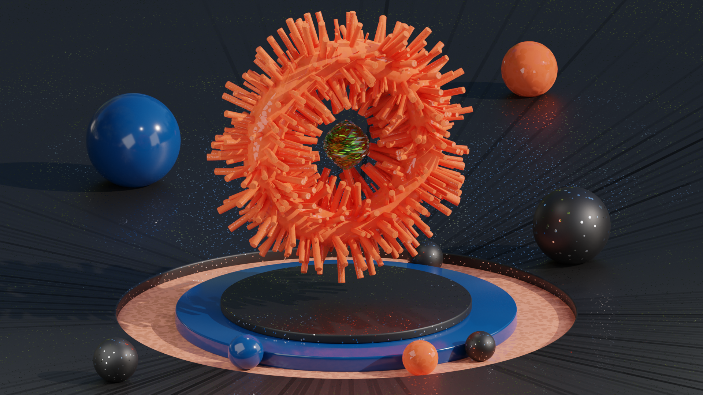

# Wallpaper-with-array-modifier
 Here I tried to created some abstract design and some animation with it by watching youtubes video from channel Ducky 3D.

</img>

  

</img>

  

</img>

  

</img>

  

</img>

  